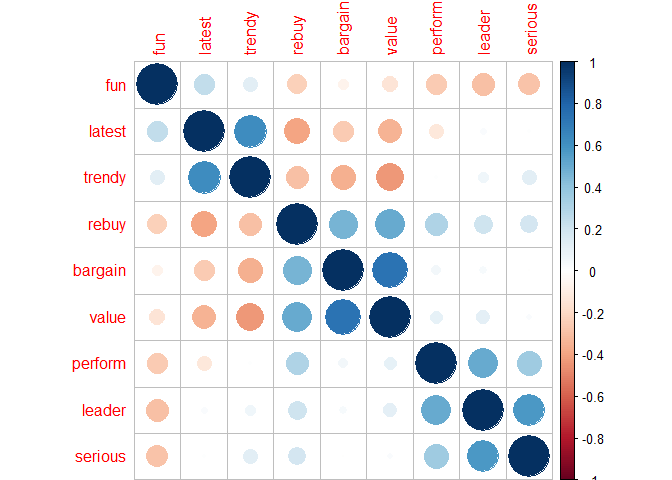
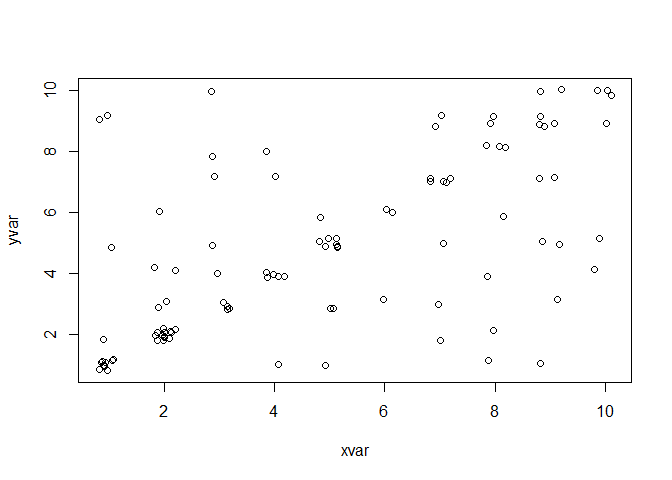
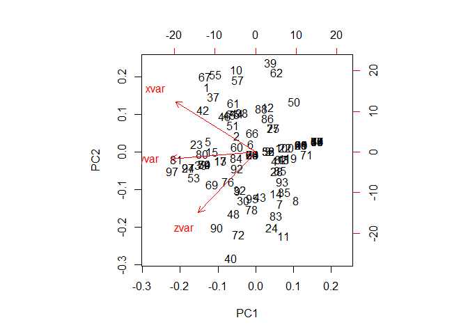
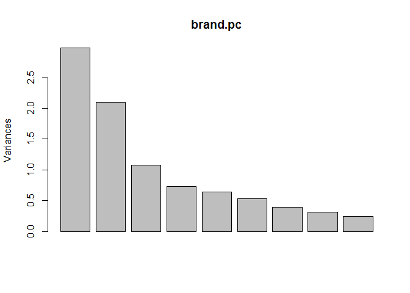
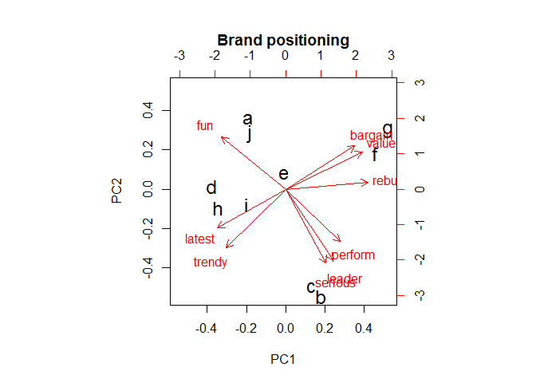

# Advanced Marketing Applications
MOHAMMAD SHADAN  
February 1, 2017  
Marketing data sets often have many variables-many dimensions-and it is advantageous to reduce these to smaller sets of variables to consider.    

For instance, we might have many items on a consumer survey that reflect a smaller number of underlying concepts such as :

- **customer satisfaction** with a service, 
- **category leadership** for a brand, or 
- **luxury** for a product. 

If we can reduce the data to its underlying dimensions, we can more clearly identify the relationships among concepts.


Three common methods to reduce complexity by reducing the number of dimensions in the data :

- **Principal component analysis (PCA)** attempts to find uncorrelated linear dimensions that capture maximal variance in the data. 

- **Exploratory factor analysis (EFA)** also attempts to capture variance with a small number of dimensions while seeking to make the dimensions interpretable in terms of the original variables. 

- **Multidimensional scaling (MDS)** maps similarities among observations in terms of a low-dimension space such as a two-dimensional plot. MDS can work with metric data and with non-metric data such as categorical or ordinal data.

PCA is often associated with **perceptual maps**, which are visualizations of respondents' associations among brands or products.

##8.1 Consumer Brand Rating Data  

```r
brand.ratings <- read.csv("http://goo.gl/IQl8nc")
# write.csv(brand.ratings, "brand_ratings.csv")
# ?write.csv
head(brand.ratings)
```

```
##   perform leader latest fun serious bargain value trendy rebuy brand
## 1       2      4      8   8       2       9     7      4     6     a
## 2       1      1      4   7       1       1     1      2     2     a
## 3       2      3      5   9       2       9     5      1     6     a
## 4       1      6     10   8       3       4     5      2     1     a
## 5       1      1      5   8       1       9     9      1     1     a
## 6       2      8      9   5       3       8     7      1     2     a
```

```r
tail(brand.ratings)
```

```
##      perform leader latest fun serious bargain value trendy rebuy brand
## 995        4      2      8   7       1       3     3      5     2     j
## 996        2      2      3   6       4       8     5      1     2     j
## 997        3      2      6   7       1       3     3      2     1     j
## 998        1      1     10  10       1       6     5      5     2     j
## 999        1      1      7   5       1       1     2      5     1     j
## 1000       7      4      7   8       4       1     2      5     1     j
```

Summary Statistics

```r
str(brand.ratings)
```

```
## 'data.frame':	1000 obs. of  10 variables:
##  $ perform: int  2 1 2 1 1 2 1 2 2 3 ...
##  $ leader : int  4 1 3 6 1 8 1 1 1 1 ...
##  $ latest : int  8 4 5 10 5 9 5 7 8 9 ...
##  $ fun    : int  8 7 9 8 8 5 7 5 10 8 ...
##  $ serious: int  2 1 2 3 1 3 1 2 1 1 ...
##  $ bargain: int  9 1 9 4 9 8 5 8 7 3 ...
##  $ value  : int  7 1 5 5 9 7 1 7 7 3 ...
##  $ trendy : int  4 2 1 2 1 1 1 7 5 4 ...
##  $ rebuy  : int  6 2 6 1 1 2 1 1 1 1 ...
##  $ brand  : Factor w/ 10 levels "a","b","c","d",..: 1 1 1 1 1 1 1 1 1 1 ...
```

```r
summary(brand.ratings)
```

```
##     perform           leader           latest            fun        
##  Min.   : 1.000   Min.   : 1.000   Min.   : 1.000   Min.   : 1.000  
##  1st Qu.: 1.000   1st Qu.: 2.000   1st Qu.: 4.000   1st Qu.: 4.000  
##  Median : 4.000   Median : 4.000   Median : 7.000   Median : 6.000  
##  Mean   : 4.488   Mean   : 4.417   Mean   : 6.195   Mean   : 6.068  
##  3rd Qu.: 7.000   3rd Qu.: 6.000   3rd Qu.: 9.000   3rd Qu.: 8.000  
##  Max.   :10.000   Max.   :10.000   Max.   :10.000   Max.   :10.000  
##                                                                     
##     serious          bargain           value            trendy     
##  Min.   : 1.000   Min.   : 1.000   Min.   : 1.000   Min.   : 1.00  
##  1st Qu.: 2.000   1st Qu.: 2.000   1st Qu.: 2.000   1st Qu.: 3.00  
##  Median : 4.000   Median : 4.000   Median : 4.000   Median : 5.00  
##  Mean   : 4.323   Mean   : 4.259   Mean   : 4.337   Mean   : 5.22  
##  3rd Qu.: 6.000   3rd Qu.: 6.000   3rd Qu.: 6.000   3rd Qu.: 7.00  
##  Max.   :10.000   Max.   :10.000   Max.   :10.000   Max.   :10.00  
##                                                                    
##      rebuy            brand    
##  Min.   : 1.000   a      :100  
##  1st Qu.: 1.000   b      :100  
##  Median : 3.000   c      :100  
##  Mean   : 3.727   d      :100  
##  3rd Qu.: 5.000   e      :100  
##  Max.   :10.000   f      :100  
##                   (Other):400
```

Perceptual adjective (column name) Example survey text   
`perform` : Brand has strong performance    
`leader` : Brand is a leader in the field   
`latest` : Brand has the latest products     
`fun`  : Brand is fun    
`serious` : Brand is serious
`bargain` : Brand products are a bargain    
`value` : Brand products are a good value    
`trendy` : Brand is trendy    
`rebuy` :I would buy from Brand again     

###8.1.1 Rescaling the Data

```r
brand.sc <- brand.ratings
brand.sc[, 1:9] <- scale(brand.ratings[, 1:9])
summary(brand.sc)
```

```
##     perform            leader            latest             fun          
##  Min.   :-1.0888   Min.   :-1.3100   Min.   :-1.6878   Min.   :-1.84677  
##  1st Qu.:-1.0888   1st Qu.:-0.9266   1st Qu.:-0.7131   1st Qu.:-0.75358  
##  Median :-0.1523   Median :-0.1599   Median : 0.2615   Median :-0.02478  
##  Mean   : 0.0000   Mean   : 0.0000   Mean   : 0.0000   Mean   : 0.00000  
##  3rd Qu.: 0.7842   3rd Qu.: 0.6069   3rd Qu.: 0.9113   3rd Qu.: 0.70402  
##  Max.   : 1.7206   Max.   : 2.1404   Max.   : 1.2362   Max.   : 1.43281  
##                                                                          
##     serious           bargain             value             trendy        
##  Min.   :-1.1961   Min.   :-1.22196   Min.   :-1.3912   Min.   :-1.53897  
##  1st Qu.:-0.8362   1st Qu.:-0.84701   1st Qu.:-0.9743   1st Qu.:-0.80960  
##  Median :-0.1163   Median :-0.09711   Median :-0.1405   Median :-0.08023  
##  Mean   : 0.0000   Mean   : 0.00000   Mean   : 0.0000   Mean   : 0.00000  
##  3rd Qu.: 0.6036   3rd Qu.: 0.65279   3rd Qu.: 0.6933   3rd Qu.: 0.64914  
##  Max.   : 2.0434   Max.   : 2.15258   Max.   : 2.3610   Max.   : 1.74319  
##                                                                           
##      rebuy             brand    
##  Min.   :-1.0717   a      :100  
##  1st Qu.:-1.0717   b      :100  
##  Median :-0.2857   c      :100  
##  Mean   : 0.0000   d      :100  
##  3rd Qu.: 0.5003   e      :100  
##  Max.   : 2.4652   f      :100  
##                    (Other):400
```


```r
library(corrplot)
corrplot(cor(brand.sc[, 1:9]), order="hclust")
```

<!-- -->

###8.1.2 Aggregate Mean Ratings by Brand

```r
brand.mean <- aggregate(. ~ brand, data=brand.sc, mean)
brand.mean
```

```
##    brand     perform     leader     latest        fun     serious
## 1      a -0.88591874 -0.5279035  0.4109732  0.6566458 -0.91894067
## 2      b  0.93087022  1.0707584  0.7261069 -0.9722147  1.18314061
## 3      c  0.64992347  1.1627677 -0.1023372 -0.8446753  1.22273461
## 4      d -0.67989112 -0.5930767  0.3524948  0.1865719 -0.69217505
## 5      e -0.56439079  0.1928362  0.4564564  0.2958914  0.04211361
## 6      f -0.05868665  0.2695106 -1.2621589 -0.2179102  0.58923066
## 7      g  0.91838369 -0.1675336 -1.2849005 -0.5167168 -0.53379906
## 8      h -0.01498383 -0.2978802  0.5019396  0.7149495 -0.14145855
## 9      i  0.33463879 -0.3208825  0.3557436  0.4124989 -0.14865746
## 10     j -0.62994504 -0.7885965 -0.1543180  0.2849595 -0.60218870
##        bargain       value      trendy       rebuy
## 1   0.21409609  0.18469264 -0.52514473 -0.59616642
## 2   0.04161938  0.15133957  0.74030819  0.23697320
## 3  -0.60704302 -0.44067747  0.02552787 -0.13243776
## 4  -0.88075605 -0.93263529  0.73666135 -0.49398892
## 5   0.55155051  0.41816415  0.13857986  0.03654811
## 6   0.87400696  1.02268859 -0.81324496  1.35699580
## 7   0.89650392  1.25616009 -1.27639344  1.36092571
## 8  -0.73827529 -0.78254646  0.86430070 -0.60402622
## 9  -0.25459062 -0.80339213  0.59078782 -0.20317603
## 10 -0.09711188 -0.07379367 -0.48138267 -0.96164748
```


```r
rownames(brand.mean) <- brand.mean[, 1]
brand.mean <- brand.mean[, -1]
```


```r
# install.packages("gplots")
suppressMessages(library(gplots))
suppressMessages(library(RColorBrewer))
```

A heatmap is a useful way to examine such results because it colors data points by the intensities of their values. We use 
heatmap.2() from the gplots package [158] with colors from the RColorBrewer package [121] (install those if you need them):


```r
heatmap.2(as.matrix(brand.mean),
        col=brewer.pal(9, "GnBu"), trace="none", key=FALSE, dend="none",
        main="\n\n\n\n\nBrand attributes")
```

<!-- -->

##8.2 Principal Component Analysis and Perceptual Maps

PCA recomputes a set of variables in terms of linear equations, known as components, that capture linear relationships in the data.    
The **first component** captures as much of the variance as possible from all variables as a single linear function.   
The **second component** captures as much variance as possible that remains after the first component. This continues until there are as many components as there are variables.    
We can use this process to reduce data complexity by retaining and analyzing
only a subset of those components-such as the first one or two components-that explain a large proportion of the variation in the data.


Other Similar Definition :   
In this technique, variables are transformed into a new set of variables, which are linear combination of original variables. These new set of variables are known as principle components. They are obtained in such a way that _**first principle component accounts for most of the possible variation of original data**_ after which each succeeding component has the highest possible variance.    

The _**second principal component must be orthogonal to the first principal component**_. In other words, it does its best to capture the variance in the data that is not captured by the first principal component. For two-dimensional dataset, there can be only two principal components.

###8.2.1 PCA Example

```r
set.seed(98286)
xvar <- sample(1:10, 100, replace=TRUE)
yvar <- xvar
yvar[sample(1:length(yvar), 50)] <- sample(1:10, 50, replace=TRUE)
zvar <- yvar
zvar[sample(1:length(zvar), 50)] <- sample(1:10, 50, replace=TRUE)
my.vars <- cbind(xvar, yvar, zvar)
```


```r
plot(yvar ~ xvar, data=jitter(my.vars))
```

<!-- -->

```r
cor(my.vars)
```

```
##           xvar      yvar      zvar
## xvar 1.0000000 0.5969717 0.2496469
## yvar 0.5969717 1.0000000 0.5231468
## zvar 0.2496469 0.5231468 1.0000000
```

- The bivariate plot shows a clear linear trend for yvar vs. xvar on the diagonal.    
- In the correlation matrix, xvar correlates highly with yvar and less so with zvar, as expected, and yvar has strong correlation with zvar    

What would we expect the components to be from this data?    
- First, there is shared variance across all three variables because they are positively correlated. So we expect to see one component that picks up that association of all three
variables. 
- After that, we expect to see a component that shows that xvar and zvar are more differentiated from one another than either is from yvar. That implies that yvar has a unique position in the data set as the only variable to correlate highly with both of the others, so we expect one of the components to reflect this uniqueness of yvar.


Using prcomp() to perform PCA

```r
my.pca <- prcomp(my.vars)
summary(my.pca)
```

```
## Importance of components:
##                           PC1    PC2    PC3
## Standard deviation     3.9992 2.4381 1.6269
## Proportion of Variance 0.6505 0.2418 0.1077
## Cumulative Proportion  0.6505 0.8923 1.0000
```

- There are three components because we have three variables. 
- The first component accounts for 65 % of the explainable linear variance, while the second accounts for 24 %, leaving 11 % for the third component.     

How are those components related to the variables?    
We check the rotation matrix, which is helpfully printed by default for a PCA object:


```r
my.pca
```

```
## Standard deviations:
## [1] 3.999154 2.438079 1.626894
## 
## Rotation:
##             PC1         PC2        PC3
## xvar -0.6156755  0.63704774  0.4638037
## yvar -0.6532994 -0.08354009 -0.7524766
## zvar -0.4406173 -0.76628404  0.4676165
```

In **component one** (PC1) we see loading on all 3 variables as expected from their overall shared variance (the negative direction is not important; the key is that they are all in the same direction).    

In **component two**, we see that xvar and zvar are differentiated from one another as expected, with loadings in opposite directions.    

Finally, in **component three**, we see residual variance that differentiates yvar from the other two variables and is consistent with our intuition about yvar being unique.    

In addition to the loading matrix, PCA has computed scores for each of the principal components that express the underlying data in terms of its loadings on those components.
Those are present in the PCA object as the **$x matrix**, where the columns ([ , 1],[ , 2], and so forth) may be used to obtain the values of the components for each observation. We can use a small number of those columns in place of the original data to obtain a set of observations that captures much of the variation in the data.

A less obvious feature of PCA, but implicit in the definition, is that extracted PCA components are uncorrelated with one another, because otherwise there would be more linear variance that could have been captured.    

Score returned for observations in a PCA model, where the off-diagonal correlations are effectively zero.


```r
cor(my.pca$x) # components have zero correlation
```

```
##              PC1           PC2           PC3
## PC1 1.000000e+00  4.808932e-16  1.768720e-15
## PC2 4.808932e-16  1.000000e+00 -1.174441e-15
## PC3 1.768720e-15 -1.174441e-15  1.000000e+00
```


###8.2.2 Visualizing PCA

A good way to examine the results of PCA is to map the first few components, which allows us to visualize the data in a lower-dimensional space. A common visualization is a **biplot**, a two-dimensional plot of data points with respect to the first two PCA components, overlaid with a projection of the variables on the components.


```r
biplot(my.pca)
```

<!-- -->

Every data point is plotted (and labeled by row number) according to its values on the first two components. Such plots are especially helpful when there are a smaller number of points (as we will see below for brands) or when
there are clusters   

There are arrows that show the best fit of each of the variables on the principal components-a projection of the variables onto the two-dimensional space of the first two PCA components, which explain a large part of the variation in the data.   

These are useful to inspect because the direction and angle of the arrows reflect there are arrows that show the best fit of each of the variables on the principal components-a projection of the variables onto the two-dimensional space of the first two PCA components, which explain a large part of the variation in the data.

We see in the variable projections (arrows) that yvar is closely aligned with the first component (X axis). In the relationships among the variables themselves, we see that xvar and zvar are more associated with yvar, relative to
the principal components, than either is with the other. Thus, this visually matches our interpretation of the correlation matrix and loadings above.

###8.2.3 PCA for Brand Ratings

```r
brand.pc <- prcomp(brand.sc[, 1:9])
summary(brand.pc)
```

```
## Importance of components:
##                          PC1    PC2    PC3    PC4     PC5     PC6     PC7
## Standard deviation     1.726 1.4479 1.0389 0.8528 0.79846 0.73133 0.62458
## Proportion of Variance 0.331 0.2329 0.1199 0.0808 0.07084 0.05943 0.04334
## Cumulative Proportion  0.331 0.5640 0.6839 0.7647 0.83554 0.89497 0.93831
##                            PC8     PC9
## Standard deviation     0.55861 0.49310
## Proportion of Variance 0.03467 0.02702
## Cumulative Proportion  0.97298 1.00000
```

The default plot() for a PCA is a `scree plot`, which shows the successive proportion of additional variance that each component adds. We plot this as a line chart using type="l" (lower case "L" for line):


```r
plot(brand.pc, type="l")
```

<!-- -->

```r
plot(brand.pc)
```

<!-- -->

- A scree plot is often interpreted as indicating where additional components are not worth the complexity; this occurs where the line has an elbow, a kink in the angle of bending, a somewhat subjective determination.   
- The elbow occurs at either component three or four, depending on interpretation; and this suggests that the first two or three components explain most of the variation in the observed brand ratings.

A biplot() of the first two principal components-which biplot() selects by default for a PCA object-reveals how the rating adjectives are associated:

```r
biplot(brand.pc)
```

<!-- -->

We see the result in above figure, where adjectives map in four regions: category leadership ("serious," "leader," and "perform" in the upper right), value ("rebuy,""value," and "bargain"), trendiness ("trendy" and "latest"), and finally "fun" on its own.

But there is a problem: the plot of individual respondents' ratings is too dense and it does not tell us about the brand positions! A better solution is to perform PCA using aggregated ratings by brand.    
First we remind ourselves of the data that compiled the mean rating of each adjective by brand as we found above using aggregate(). Then we extract the principal components:


```r
brand.mean
```

```
##       perform     leader     latest        fun     serious     bargain
## a -0.88591874 -0.5279035  0.4109732  0.6566458 -0.91894067  0.21409609
## b  0.93087022  1.0707584  0.7261069 -0.9722147  1.18314061  0.04161938
## c  0.64992347  1.1627677 -0.1023372 -0.8446753  1.22273461 -0.60704302
## d -0.67989112 -0.5930767  0.3524948  0.1865719 -0.69217505 -0.88075605
## e -0.56439079  0.1928362  0.4564564  0.2958914  0.04211361  0.55155051
## f -0.05868665  0.2695106 -1.2621589 -0.2179102  0.58923066  0.87400696
## g  0.91838369 -0.1675336 -1.2849005 -0.5167168 -0.53379906  0.89650392
## h -0.01498383 -0.2978802  0.5019396  0.7149495 -0.14145855 -0.73827529
## i  0.33463879 -0.3208825  0.3557436  0.4124989 -0.14865746 -0.25459062
## j -0.62994504 -0.7885965 -0.1543180  0.2849595 -0.60218870 -0.09711188
##         value      trendy       rebuy
## a  0.18469264 -0.52514473 -0.59616642
## b  0.15133957  0.74030819  0.23697320
## c -0.44067747  0.02552787 -0.13243776
## d -0.93263529  0.73666135 -0.49398892
## e  0.41816415  0.13857986  0.03654811
## f  1.02268859 -0.81324496  1.35699580
## g  1.25616009 -1.27639344  1.36092571
## h -0.78254646  0.86430070 -0.60402622
## i -0.80339213  0.59078782 -0.20317603
## j -0.07379367 -0.48138267 -0.96164748
```

```r
brand.mu.pc <- prcomp(brand.mean, scale=TRUE)
summary(brand.mu.pc)
```

```
## Importance of components:
##                           PC1    PC2    PC3     PC4     PC5     PC6
## Standard deviation     2.1345 1.7349 0.7690 0.61498 0.50983 0.36662
## Proportion of Variance 0.5062 0.3345 0.0657 0.04202 0.02888 0.01493
## Cumulative Proportion  0.5062 0.8407 0.9064 0.94842 0.97730 0.99223
##                            PC7     PC8     PC9
## Standard deviation     0.21506 0.14588 0.04867
## Proportion of Variance 0.00514 0.00236 0.00026
## Cumulative Proportion  0.99737 0.99974 1.00000
```
In the call to prcomp(), we added scale=TRUE in order to rescale the data; even though the raw data was already rescaled, the aggregated means have a somewhat different scale than the standardized data itself.    

The results show that the first two components account for 84 % of the explainable variance in the mean ratings, so we focus on interpreting results with regard to them.

Proportion of Variance **0.5062 0.3345** 0.0657 0.04202 0.02888 0.01493 0.00514 0.00236 0.00026   

(0.5062 + 0.3345) / (0.5062 +0.3345 +0.0657+ 0.04202 +0.02888+ 0.01493+ 0.00514+ 0.00236+ 0.00026)

###8.2.4 Perceptual Map of the Brands

A biplot of the PCA solution for the mean ratings gives an interpretable perceptual map, showing where the brands are placed with respect to the first two principal components. We use biplot() on the PCA solution for the mean rating by
brand:


```r
biplot(brand.mu.pc, main="Brand positioning", cex=c(1.5, 1))
```

<!-- -->


Before interpreting the new map, we first check that using mean data did not greatly alter the structure. 

Above figure shows a different spatial rotation of the adjectives, compared to previous one, but the spatial position is arbitrary and the new map has the same overall grouping of adjectives and relational structure (for instance, seeing as in previous figure that "serious" and "leader" are closely related while "fun" is rather distant from other adjectives).    

Thus the variable positions on the components are consistent with PCA on the full set of observations, and we go ahead to interpret the graphic.

_**So what does the map tell us ?**_

- First we interpret the adjective clusters and relationships and see four areas with well differentiated sets of adjectives and brands that are positioned in proximity. Brands f and g are high on "value," for instance, while a and j are relatively high on "fun," which is opposite in direction from leadership adjectives ("leader" and "serious").

What should you do about the position of your brand e? Again, it depends on the strategic goals. If you wish to increase differentiation, one possibility would be to take action to shift your brand in some direction on the map. Suppose you wanted to move in the direction of brand c. You could look at the specific differences from
c in the data:  


```r
brand.mean["c", ] - brand.mean["e", ]
```

```
##    perform    leader     latest       fun  serious   bargain      value
## c 1.214314 0.9699315 -0.5587936 -1.140567 1.180621 -1.158594 -0.8588416
##      trendy      rebuy
## c -0.113052 -0.1689859
```

This shows you that e is relatively stronger than c on "value" and "fun", which suggests dialing down messaging or other attributes that reinforce those (assuming, of course, that you truly want to move in the direction of c). Similarly, c is stronger on "perform" and "serious," so those could be aspects of the product or message for
e to strengthen.

Another option would be not to follow another brand but to aim for differentiated space where no brand is positioned. There is a large gap between the group b and c on the bottom of the chart, versus f and g on the upper right. This area might be described as the "value leader" area or similar.

_**How do we find out how to position there? **_    
Let's assume that the gap reflects approximately the average of those four brands. We can find that average using colMeans() on the brands' rows, and then take the difference of e from that average:


```r
colMeans(brand.mean[c("b", "c", "f", "g"), ]) - brand.mean["e", ]
```

```
##    perform    leader     latest        fun   serious    bargain      value
## e 1.174513 0.3910396 -0.9372789 -0.9337707 0.5732131 -0.2502787 0.07921355
##       trendy     rebuy
## e -0.4695304 0.6690661
```

Observation : This suggests that brand e could target the gap by increasing its emphasis on performance while reducing emphasis on "latest" and "fun."      

To summarize, when you wish to compare several brands across many dimensions, it can be helpful to focus on just the first two or three principal components that explain variation in the data. You can select how many components to focus on using a scree plot, which shows how much variation in the data is explained by each principal component. A perceptual map plots the brands on the first two principal components, revealing how the observations relate to the underlying dimensions (the components).     

PCA may be performed using survey ratings of the brands (as we have done here) or with objective data such as price and physical measurements, or with a combination of the two. In any case, when you are confronted with multidimensional data on brands or products, PCA visualization is a useful tool for understanding differences
in the market.     

###8.2.5 Cautions with Perceptual Maps

There are three important caveats in interpreting perceptual maps.

- First, you must choose the level and type of aggregation carefully. We demonstrated the maps using mean rating by brand, but depending on the data and question at hand, it might be more suitable to use median (for ordinal data) or even modal response (for categorical data).

- Second, the relationships are strictly relative to the product category and the brands and adjectives that are tested.

- Third, it is frequently misunderstood that the positions of brands in such a map depend on their relative positioning in terms of the principal components, which are constructed composites of all dimensions. This means that the strength of a brand on a single adjective cannot be read directly from the chart. For instance, in Fig. 8.7,
it might appear that brands b and c are weaker than d, h, and i on "latest" but are similar to one another. In fact, b is the single strongest brand on "latest" while c is weak on that adjective. Overall, b and c are quite similar to one another in terms of their scores on the two components that aggregate all of the variables (adjectives), but they are not necessarily similar on any single variable. Another way to look at this is that when we use PCA to focus on the first one or two dimensions in the data, we are looking at the largest-magnitude similarities, which may obscure smaller differences that do not show up strongly in the first one or two dimensions.   

Although illustrated PCA with brand position, the same kind of analysis could be performed for product ratings, position of consumer segments, ratings of political candidates, evaluations of advertisements, or any other area where you have metric data on multiple dimensions that is aggregated for a modest number of discrete entities of interest.

## 8.3 Exploratory Factor Analysis

EFA is a family of techniques to assess the relationship of constructs (concepts) in surveys and psychological assessments. Factors are regarded as latent variables that cannot be observed directly, but are imperfectly assessed through their relationship to other variables.

In marketing, we often observe a large number of variables that we believe should be related to a smaller set of underlying constructs. For example, we cannot directly observe customer satisfaction but we might observe responses on a survey that asks about different aspects of a customer's experience, jointly representing different facets of the underlying construct satisfaction. Similarly, we cannot directly observe purchase intent, price sensitivity, or category involvement but we can observe multiple behaviors that are related to them.

In this section, we use EFA to examine respondents' attitudes about brands, using the brand rating data from above (Sect. 8.1) to uncover the latent dimensions in the data. Then we assess the brands in terms of those estimated latent factors.

###8.3.1 Basic EFA Concepts

EFA serves as a data reduction technique in three broad senses:

1. In the technical sense of dimensional reduction, we can use factor scores instead of a larger set of items. For instance, if we are assessing satisfaction, we could use a single satisfaction score instead of several separate items.  
2. We can reduce uncertainty. If we believe satisfaction is imperfectly manifest in several measures, the combination of those will have less noise than the set of individual items.
3. We might also reduce data collection by focusing on items that are known to have high contribution to factors of interest. If we discover that some items are not important for a factor of interest, we can discard them from data collection efforts.   

- How many latent factors are there? 
- How do the survey items map to the factors?
- How are the brands positioned on the factors? 
- What are the respondents' factor scores?

### 8.3.2 Finding an EFA Solution

- The first step in EFA is to determine the number of factors to estimate. 
- There are various ways to do this, and two traditional methods are to use a `scree plot`, and to retain factors where the `eigenvalue` (a metric for proportion of variance explained) is greater than 1.0. 
- An eigenvalue of 1.0 corresponds to the amount of variance that might be attributed to a single independent variable; a factor that captures less variance than such an item may be considered relatively uninteresting.

```r
# install.packages("nFactors")
suppressMessages(library(nFactors))
nScree(brand.sc[, 1:9])
```

```
##   noc naf nparallel nkaiser
## 1   3   2         3       3
```

nScree() applies several methods to estimate the number of factors from scree tests, and in the present case three of the four methods suggest that the data set has 3 factors. We can examine the eigenvalues using eigen() on a correlation matrix:


```r
eigen(cor(brand.sc[, 1:9]))
```

```
## $values
## [1] 2.9792956 2.0965517 1.0792549 0.7272110 0.6375459 0.5348432 0.3901044
## [8] 0.3120464 0.2431469
## 
## $vectors
##             [,1]        [,2]        [,3]        [,4]        [,5]
##  [1,] -0.2374679 -0.41991179  0.03854006  0.52630873  0.46793435
##  [2,] -0.2058257 -0.52381901 -0.09512739  0.08923461 -0.29452974
##  [3,]  0.3703806 -0.20145317 -0.53273054 -0.21410754  0.10586676
##  [4,]  0.2510601  0.25037973 -0.41781346  0.75063952 -0.33149429
##  [5,] -0.1597402 -0.51047254 -0.04067075 -0.09893394 -0.55515540
##  [6,] -0.3991731  0.21849698 -0.48989756 -0.16734345 -0.01257429
##  [7,] -0.4474562  0.18980822 -0.36924507 -0.15118500 -0.06327757
##  [8,]  0.3510292 -0.31849032 -0.37090530 -0.16764432  0.36649697
##  [9,] -0.4390184 -0.01509832 -0.12461593  0.13031231  0.35568769
##             [,6]         [,7]        [,8]        [,9]
##  [1,]  0.3370676  0.364179109 -0.14444718 -0.05223384
##  [2,]  0.2968860 -0.613674301  0.28766118  0.17889453
##  [3,]  0.1742059 -0.185480310 -0.64290436 -0.05750244
##  [4,] -0.1405367 -0.007114761  0.07461259 -0.03153306
##  [5,] -0.3924874  0.445302862 -0.18354764 -0.09072231
##  [6,]  0.1393966  0.288264900  0.05789194  0.64720849
##  [7,]  0.2195327  0.017163011  0.14829295 -0.72806108
##  [8,] -0.2658186  0.153572108  0.61450289 -0.05907022
##  [9,] -0.6751400 -0.388656160 -0.20210688  0.01720236
```

The first three eigenvalues are greater than 1.0, although barely so for the third value.
This again suggests 3-or possibly 2-factors.
The final choice of a model depends on whether it is useful. For EFA, a best practice is to check a few factor solutions, including the ones suggested by the scree and eigenvalue results. Thus, we test a 3-factor solution and a 2-factor solution to see which one is more useful.

An EFA model is estimated with factanal(x, factors=K), where K is the number of factors to fit. For a 2-factor solution, we write:

```r
factanal(brand.sc[, 1:9], factors=2)
```

```
## 
## Call:
## factanal(x = brand.sc[, 1:9], factors = 2)
## 
## Uniquenesses:
## perform  leader  latest     fun serious bargain   value  trendy   rebuy 
##   0.635   0.332   0.796   0.835   0.527   0.354   0.225   0.708   0.585 
## 
## Loadings:
##         Factor1 Factor2
## perform          0.600 
## leader           0.818 
## latest  -0.451         
## fun     -0.137  -0.382 
## serious          0.686 
## bargain  0.803         
## value    0.873   0.117 
## trendy  -0.534         
## rebuy    0.569   0.303 
## 
##                Factor1 Factor2
## SS loadings      2.245   1.759
## Proportion Var   0.249   0.195
## Cumulative Var   0.249   0.445
## 
## Test of the hypothesis that 2 factors are sufficient.
## The chi square statistic is 556.19 on 19 degrees of freedom.
## The p-value is 8.66e-106
```

We have removed all of the information except for the loadings because those are the most important to interpret (see "Learning More" in this chapter for material that explains much more about EFA and the output of such procedures). Some of the factor loadings are near zero, and are not shown; this makes EFA potentially easier to interpret than PCA.
In the 2-factor solution, factor 1 loads strongly on "bargain" and "value," and therefore might be interpreted as a "value" factor while factor 2 loads on "leader" and "serious" and thus might be regarded as a "category leader" factor.   
This is not a bad interpretation, but let's compare it to a 3-factor solution:

```r
factanal(brand.sc[, 1:9], factors=3)
```

```
## 
## Call:
## factanal(x = brand.sc[, 1:9], factors = 3)
## 
## Uniquenesses:
## perform  leader  latest     fun serious bargain   value  trendy   rebuy 
##   0.624   0.327   0.005   0.794   0.530   0.302   0.202   0.524   0.575 
## 
## Loadings:
##         Factor1 Factor2 Factor3
## perform          0.607         
## leader           0.810   0.106 
## latest  -0.163           0.981 
## fun             -0.398   0.205 
## serious          0.682         
## bargain  0.826          -0.122 
## value    0.867          -0.198 
## trendy  -0.356           0.586 
## rebuy    0.499   0.296  -0.298 
## 
##                Factor1 Factor2 Factor3
## SS loadings      1.853   1.752   1.510
## Proportion Var   0.206   0.195   0.168
## Cumulative Var   0.206   0.401   0.568
## 
## Test of the hypothesis that 3 factors are sufficient.
## The chi square statistic is 64.57 on 12 degrees of freedom.
## The p-value is 3.28e-09
```

The 3-factor solution retains the "value" and "leader" factors and adds a clear "latest" factor that loads strongly on "latest" and "trendy." This adds a clearly interpretable concept to our understanding of the data. It also aligns with the bulk of suggestions from the scree and eigen tests, and fits well with the perceptual maps we saw in Sect. 8.2.4, where those adjectives were in a differentiated space. So we regard the 3-factor model as superior to the 2-factor model because the factors are more interpretable.

###8.3.3 EFA Rotations


How EFA differs from PCA, it differs mathematically because EFA finds latent variables that may be observed with error (see [119]) whereas PCA simply recomputes transformations of the observed data. In other words, EFA focuses on the underlying latent dimensions, whereas PCA focuses on transforming the dimensionality of the data.

###8.3.4 Using Factor Scores for Brands
