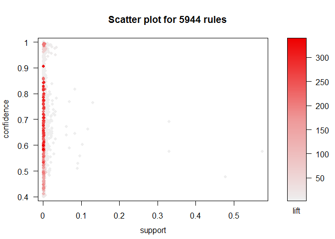

# Market Basket Analysis
MOHAMMAD SHADAN  
February 4, 2017  

Many firms compile records of customer transactions. These data sets take diverse forms including products that are purchased together, services that are tracked over time in a customer relationship management (CRM) system, sequences of visits and actions on aWeb site, and records of customer support calls. These records are very valuable to marketers and inform us about customers' purchasing patterns, ways in which we might optimize pricing or inventory given the purchase patterns, and relationships between the purchases and other customer information.

Such records may comprise an enormous number of data points yet with relatively little information in each observation. This means that simple analyses such as correlation and linear regression are not applicable because those methods assume complete or near-complete measurement for each case. For example, consider the number of products in a typical supermarket. Most items are not purchased with most other items in any transaction because there are so many possible combinations.


##12.1 The Basics of Association Rules

Some terms to understand for association rules :   

- `Association` : An association is simply the co-occurrence of two or more things.
- `Set of items` : A set of items is a group of one or more items, and might be written as {item1, item2, . . .}
- `Transaction` : A transaction is a set of items that co-occur in an observation
- `Market Basket` : The set of things that are purchased or considered for purchase at one time.
- `Rule` : A rule expresses the incidence across transactions of one set of items as a condition of another set of items

###12.1.1 Metrics

Association rules are expressed with a few common metrics that reflect the rules of conditional probability.

- `Support` : The support for a set of items is the proportion of all transactions that contain the set. If {hot dogs, soda} appears in 10 out of 200 transactions, then support({hotdogs,soda}) = 0.05. It does not matter if those 10 transactions contain other items; support is defined separately for every unique set of items.
- `Confidence` : Confidence is the support for the co-occurrence of all items in a rule, conditional on the support for the left-hand set alone. Thus, confidence(X -> Y) = support(X and Y)/support(X)
- `Lift` :  the support of a set conditional on the joint support of each element, or lift(X =>Y)=support(X and Y)/(support(X)support(Y))

These three measures tell us different things. When we search for rules we wish to exceed a minimum threshold on each: to find item sets that occur relatively frequently in transactions (support), that show strong conditional relationships (confidence), and that are more common than chance (lift).

We use the R package arules to illustrate association rules. arules encapsulates many popular methods for mining associations and provides extensions for visualization [69]. Readers who are interested in the algorithms that generate association rules should review the references in the primary arules documentation

##12.2 Retail Transaction Data: Market Baskets

The first two data sets we examine contain supermarket transaction data. We first examine a small data set that is included with the `arules` package. This data set is useful despite its small size because the items are labeled with category names, making them easier to read. Then we turn to a larger data set from a supermarket chain whose data is disguised but is more typical of large data sets.

###12.2.1 Example Data: Groceries

This data set comprises lists of items purchased together (that is, market baskets), where the individual items have been recorded as category labels instead of product names. You should install the `arules` and `arulesViz`
packages before proceeding.


```r
# install.packages("arules")
# install.packages("arulesViz")
library(arules)
```

```
## Loading required package: Matrix
```

```
## 
## Attaching package: 'arules'
```

```
## The following objects are masked from 'package:base':
## 
##     abbreviate, write
```

```r
library(arulesViz)
```

```
## Loading required package: grid
```

```r
data("Groceries")

summary(Groceries)
```

```
## transactions as itemMatrix in sparse format with
##  9835 rows (elements/itemsets/transactions) and
##  169 columns (items) and a density of 0.02609146 
## 
## most frequent items:
##       whole milk other vegetables       rolls/buns             soda 
##             2513             1903             1809             1715 
##           yogurt          (Other) 
##             1372            34055 
## 
## element (itemset/transaction) length distribution:
## sizes
##    1    2    3    4    5    6    7    8    9   10   11   12   13   14   15 
## 2159 1643 1299 1005  855  645  545  438  350  246  182  117   78   77   55 
##   16   17   18   19   20   21   22   23   24   26   27   28   29   32 
##   46   29   14   14    9   11    4    6    1    1    1    1    3    1 
## 
##    Min. 1st Qu.  Median    Mean 3rd Qu.    Max. 
##   1.000   2.000   3.000   4.409   6.000  32.000 
## 
## includes extended item information - examples:
##        labels  level2           level1
## 1 frankfurter sausage meat and sausage
## 2     sausage sausage meat and sausage
## 3  liver loaf sausage meat and sausage
```

```r
class(Groceries)
```

```
## [1] "transactions"
## attr(,"package")
## [1] "arules"
```

```r
inspect(head(Groceries, 3))
```

```
##     items                
## [1] {citrus fruit,       
##      semi-finished bread,
##      margarine,          
##      ready soups}        
## [2] {tropical fruit,     
##      yogurt,             
##      coffee}             
## [3] {whole milk}
```

```r
groc.rules <- apriori(Groceries, parameter=list(supp=0.01, conf=0.3, target="rules"))
```

```
## Apriori
## 
## Parameter specification:
##  confidence minval smax arem  aval originalSupport maxtime support minlen
##         0.3    0.1    1 none FALSE            TRUE       5    0.01      1
##  maxlen target   ext
##      10  rules FALSE
## 
## Algorithmic control:
##  filter tree heap memopt load sort verbose
##     0.1 TRUE TRUE  FALSE TRUE    2    TRUE
## 
## Absolute minimum support count: 98 
## 
## set item appearances ...[0 item(s)] done [0.00s].
## set transactions ...[169 item(s), 9835 transaction(s)] done [0.00s].
## sorting and recoding items ... [88 item(s)] done [0.00s].
## creating transaction tree ... done [0.00s].
## checking subsets of size 1 2 3 4 done [0.00s].
## writing ... [125 rule(s)] done [0.00s].
## creating S4 object  ... done [0.00s].
```

```r
inspect(subset(groc.rules, lift > 3))
```

```
##     lhs                   rhs                   support confidence     lift
## [1] {beef}             => {root vegetables}  0.01738688  0.3313953 3.040367
## [2] {citrus fruit,                                                         
##      root vegetables}  => {other vegetables} 0.01037112  0.5862069 3.029608
## [3] {citrus fruit,                                                         
##      other vegetables} => {root vegetables}  0.01037112  0.3591549 3.295045
## [4] {tropical fruit,                                                       
##      root vegetables}  => {other vegetables} 0.01230300  0.5845411 3.020999
## [5] {tropical fruit,                                                       
##      other vegetables} => {root vegetables}  0.01230300  0.3427762 3.144780
```

###12.2.2 Supermarket Data

We now investigate associations in a larger set of retail transaction data from a Belgian supermarket chain. This data set comprises market baskets of items purchased together, where each record includes arbitrarily numbered item numbers without item descriptions (to protect the chain's proprietary data). This data set is made publicly.


```r
retail.raw <- readLines("http://fimi.ua.ac.be/data/retail.dat")
# write.csv(retail.raw, file = "retail_raw.csv")   #Save file as .csv file for later use
# retail.raw <- readLines("http://goo.gl/FfjDAO")
class(retail.raw)
```

```
## [1] "character"
```

```r
head(retail.raw)
```

```
## [1] "0 1 2 3 4 5 6 7 8 9 10 11 12 13 14 15 16 17 18 19 20 21 22 23 24 25 26 27 28 29 "
## [2] "30 31 32 "                                                                       
## [3] "33 34 35 "                                                                       
## [4] "36 37 38 39 40 41 42 43 44 45 46 "                                               
## [5] "38 39 47 48 "                                                                    
## [6] "38 39 48 49 50 51 52 53 54 55 56 57 58 "
```

```r
tail(retail.raw)
```

```
## [1] "48 201 255 278 407 479 767 824 986 1395 1598 2022 2283 2375 6725 13334 14006 14099 "                          
## [2] "39 875 2665 2962 12959 14070 14406 15518 16379 "                                                              
## [3] "39 41 101 346 393 413 479 522 586 635 695 799 1466 1786 1994 2449 2830 3035 3591 3722 6217 11493 12129 13033 "
## [4] "2310 4267 "                                                                                                   
## [5] "39 48 2528 "                                                                                                  
## [6] "32 39 205 242 1393 "
```

```r
summary(retail.raw)
```

```
##    Length     Class      Mode 
##     88162 character character
```

```r
retail.list <- strsplit(retail.raw, " ")
class(retail.list)
```

```
## [1] "list"
```

```r
names(retail.list)
```

```
## NULL
```

```r
length(retail.list)
```

```
## [1] 88162
```

```r
names(retail.list) <- paste("Trans", 1:length(retail.list), sep="")
str(retail.list)
```

```
## List of 88162
##  $ Trans1    : chr [1:30] "0" "1" "2" "3" ...
##  $ Trans2    : chr [1:3] "30" "31" "32"
##  $ Trans3    : chr [1:3] "33" "34" "35"
##  $ Trans4    : chr [1:11] "36" "37" "38" "39" ...
##  $ Trans5    : chr [1:4] "38" "39" "47" "48"
##  $ Trans6    : chr [1:13] "38" "39" "48" "49" ...
##  $ Trans7    : chr [1:6] "32" "41" "59" "60" ...
##  $ Trans8    : chr [1:3] "3" "39" "48"
##  $ Trans9    : chr [1:6] "63" "64" "65" "66" ...
##  $ Trans10   : chr [1:2] "32" "69"
##  $ Trans11   : chr [1:4] "48" "70" "71" "72"
##  $ Trans12   : chr [1:8] "39" "73" "74" "75" ...
##  $ Trans13   : chr [1:8] "36" "38" "39" "41" ...
##  $ Trans14   : chr [1:3] "82" "83" "84"
##  $ Trans15   : chr [1:5] "41" "85" "86" "87" ...
##  $ Trans16   : chr [1:15] "39" "48" "89" "90" ...
##  $ Trans17   : chr [1:5] "36" "38" "39" "48" ...
##  $ Trans18   : chr [1:9] "39" "41" "102" "103" ...
##  $ Trans19   : chr [1:5] "38" "39" "41" "109" ...
##  $ Trans20   : chr [1:9] "39" "111" "112" "113" ...
##  $ Trans21   : chr [1:15] "119" "120" "121" "122" ...
##  $ Trans22   : chr [1:4] "48" "134" "135" "136"
##  $ Trans23   : chr [1:15] "39" "48" "137" "138" ...
##  $ Trans24   : chr [1:4] "39" "150" "151" "152"
##  $ Trans25   : chr [1:6] "38" "39" "56" "153" ...
##  $ Trans26   : chr [1:6] "48" "156" "157" "158" ...
##  $ Trans27   : chr [1:3] "39" "41" "48"
##  $ Trans28   : chr [1:7] "161" "162" "163" "164" ...
##  $ Trans29   : chr [1:9] "38" "39" "48" "168" ...
##  $ Trans30   : chr [1:9] "32" "39" "41" "48" ...
##  $ Trans31   : chr [1:10] "32" "38" "39" "47" ...
##  $ Trans32   : chr [1:4] "39" "184" "185" "186"
##  $ Trans33   : chr [1:7] "36" "38" "41" "48" ...
##  $ Trans34   : chr [1:15] "39" "48" "186" "189" ...
##  $ Trans35   : chr [1:10] "39" "201" "202" "203" ...
##  $ Trans36   : chr [1:9] "39" "65" "193" "210" ...
##  $ Trans37   : chr [1:10] "179" "216" "217" "218" ...
##  $ Trans38   : chr [1:3] "225" "226" "227"
##  $ Trans39   : chr [1:7] "39" "41" "48" "228" ...
##  $ Trans40   : chr [1:14] "36" "38" "39" "232" ...
##  $ Trans41   : chr [1:4] "39" "243" "244" "245"
##  $ Trans42   : chr [1:8] "39" "41" "48" "246" ...
##  $ Trans43   : chr [1:6] "39" "48" "65" "251" ...
##  $ Trans44   : chr [1:3] "48" "230" "254"
##  $ Trans45   : chr [1:12] "39" "48" "66" "78" ...
##  $ Trans46   : chr [1:3] "39" "48" "262"
##  $ Trans47   : chr [1:9] "36" "38" "39" "225" ...
##  $ Trans48   : chr [1:6] "39" "242" "268" "269" ...
##  $ Trans49   : chr [1:8] "39" "48" "79" "146" ...
##  $ Trans50   : chr "274"
##  $ Trans51   : chr [1:13] "32" "38" "39" "48" ...
##  $ Trans52   : chr [1:3] "39" "48" "68"
##  $ Trans53   : chr [1:10] "38" "39" "48" "95" ...
##  $ Trans54   : chr [1:16] "39" "41" "48" "212" ...
##  $ Trans55   : chr [1:3] "300" "301" "302"
##  $ Trans56   : chr [1:23] "36" "38" "39" "105" ...
##  $ Trans57   : chr [1:7] "10" "322" "323" "324" ...
##  $ Trans58   : chr [1:5] "39" "48" "152" "161" ...
##  $ Trans59   : chr [1:3] "39" "329" "330"
##  $ Trans60   : chr [1:10] "48" "331" "332" "333" ...
##  $ Trans61   : chr [1:14] "18" "37" "38" "41" ...
##  $ Trans62   : chr [1:7] "32" "39" "41" "48" ...
##  $ Trans63   : chr [1:15] "48" "351" "352" "353" ...
##  $ Trans64   : chr [1:2] "365" "366"
##  $ Trans65   : chr [1:14] "38" "39" "41" "48" ...
##  $ Trans66   : chr [1:17] "1" "11" "39" "41" ...
##  $ Trans67   : chr [1:4] "386" "387" "388" "389"
##  $ Trans68   : chr [1:3] "38" "41" "390"
##  $ Trans69   : chr [1:3] "38" "55" "391"
##  $ Trans70   : chr [1:15] "32" "43" "151" "152" ...
##  $ Trans71   : chr [1:6] "338" "400" "401" "402" ...
##  $ Trans72   : chr [1:4] "39" "405" "406" "407"
##  $ Trans73   : chr [1:22] "48" "89" "101" "179" ...
##  $ Trans74   : chr [1:8] "39" "45" "48" "248" ...
##  $ Trans75   : chr [1:7] "141" "344" "427" "428" ...
##  $ Trans76   : chr [1:4] "39" "432" "433" "434"
##  $ Trans77   : chr [1:7] "39" "48" "65" "435" ...
##  $ Trans78   : chr [1:23] "15" "23" "36" "38" ...
##  $ Trans79   : chr [1:11] "48" "451" "452" "453" ...
##  $ Trans80   : chr [1:16] "37" "38" "48" "147" ...
##  $ Trans81   : chr [1:6] "39" "48" "472" "473" ...
##  $ Trans82   : chr [1:3] "39" "41" "476"
##  $ Trans83   : chr [1:3] "477" "478" "479"
##  $ Trans84   : chr [1:9] "39" "161" "480" "481" ...
##  $ Trans85   : chr [1:7] "32" "39" "41" "48" ...
##  $ Trans86   : chr [1:6] "38" "39" "41" "105" ...
##  $ Trans87   : chr [1:2] "60" "381"
##  $ Trans88   : chr [1:17] "11" "39" "48" "255" ...
##  $ Trans89   : chr "39"
##  $ Trans90   : chr [1:3] "41" "110" "501"
##  $ Trans91   : chr [1:8] "32" "38" "39" "48" ...
##  $ Trans92   : chr [1:3] "38" "41" "504"
##  $ Trans93   : chr [1:14] "225" "232" "347" "505" ...
##  $ Trans94   : chr [1:9] "38" "39" "41" "48" ...
##  $ Trans95   : chr [1:2] "39" "48"
##  $ Trans96   : chr [1:4] "38" "39" "281" "517"
##  $ Trans97   : chr [1:4] "2" "518" "519" "520"
##  $ Trans98   : chr [1:3] "310" "521" "522"
##  $ Trans99   : chr [1:3] "41" "523" "524"
##   [list output truncated]
```

```r
library(car)
```

```
## 
## Attaching package: 'car'
```

```
## The following object is masked from 'package:arules':
## 
##     recode
```

```r
some(retail.list)
```

```
## $Trans2201
## [1] "1264" "1456" "1577" "2164" "2325" "2894" "2987" "5025" "5026"
## 
## $Trans20237
## [1] "1393" "2259" "2767" "5080" "5194" "5230" "6867" "9782"
## 
## $Trans28223
##  [1] "39"    "48"    "114"   "402"   "989"   "1019"  "1135"  "1146" 
##  [9] "1956"  "3131"  "3151"  "3205"  "3270"  "3317"  "3418"  "3849" 
## [17] "4387"  "5948"  "6046"  "6406"  "10473" "10674" "10911" "11010"
## [25] "11043" "11807" "11943"
## 
## $Trans37168
##  [1] "39"   "41"   "48"   "52"   "75"   "640"  "848"  "1393" "2113" "2337"
## [11] "2338" "3150" "4319"
## 
## $Trans43109
##  [1] "0"     "10"    "98"    "244"   "659"   "777"   "1090"  "1747" 
##  [9] "1976"  "2042"  "2187"  "2276"  "2559"  "2578"  "3609"  "3795" 
## [17] "3991"  "4420"  "4761"  "5346"  "5563"  "6148"  "6382"  "7176" 
## [25] "9053"  "9555"  "13328" "13753"
## 
## $Trans56064
## [1] "39"   "48"   "7128"
## 
## $Trans57559
## [1] "39"   "43"   "186"  "201"  "2946"
## 
## $Trans70083
##  [1] "39"    "48"    "420"   "438"   "1113"  "1561"  "3546"  "9617" 
##  [9] "9669"  "10175" "10967" "14098" "14099"
## 
## $Trans75874
##  [1] "38"   "48"   "49"   "94"   "170"  "1228" "2015" "2186" "3261" "4642"
## 
## $Trans79320
## [1] "49"    "643"   "664"   "738"   "3891"  "4386"  "12925" "12982"
```

```r
rm(retail.raw)

retail.trans <- as(retail.list, "transactions") # takes a few seconds
class(retail.trans)
```

```
## [1] "transactions"
## attr(,"package")
## [1] "arules"
```

```r
summary(retail.trans)
```

```
## transactions as itemMatrix in sparse format with
##  88162 rows (elements/itemsets/transactions) and
##  16470 columns (items) and a density of 0.0006257289 
## 
## most frequent items:
##      39      48      38      32      41 (Other) 
##   50675   42135   15596   15167   14945  770058 
## 
## element (itemset/transaction) length distribution:
## sizes
##    1    2    3    4    5    6    7    8    9   10   11   12   13   14   15 
## 3016 5516 6919 7210 6814 6163 5746 5143 4660 4086 3751 3285 2866 2620 2310 
##   16   17   18   19   20   21   22   23   24   25   26   27   28   29   30 
## 2115 1874 1645 1469 1290 1205  981  887  819  684  586  582  472  480  355 
##   31   32   33   34   35   36   37   38   39   40   41   42   43   44   45 
##  310  303  272  234  194  136  153  123  115  112   76   66   71   60   50 
##   46   47   48   49   50   51   52   53   54   55   56   57   58   59   60 
##   44   37   37   33   22   24   21   21   10   11   10    9   11    4    9 
##   61   62   63   64   65   66   67   68   71   73   74   76 
##    7    4    5    2    2    5    3    3    1    1    1    1 
## 
##    Min. 1st Qu.  Median    Mean 3rd Qu.    Max. 
##    1.00    4.00    8.00   10.31   14.00   76.00 
## 
## includes extended item information - examples:
##   labels
## 1      0
## 2      1
## 3     10
## 
## includes extended transaction information - examples:
##   transactionID
## 1        Trans1
## 2        Trans2
## 3        Trans3
```

```r
88162*16470
```

```
## [1] 1452028140
```

```r
rm(retail.list)
```

###12.3 Finding and Visualizing Association Rules


```r
retail.rules <- apriori(retail.trans, parameter=list(supp=0.001, conf=0.4))
```

```
## Apriori
## 
## Parameter specification:
##  confidence minval smax arem  aval originalSupport maxtime support minlen
##         0.4    0.1    1 none FALSE            TRUE       5   0.001      1
##  maxlen target   ext
##      10  rules FALSE
## 
## Algorithmic control:
##  filter tree heap memopt load sort verbose
##     0.1 TRUE TRUE  FALSE TRUE    2    TRUE
## 
## Absolute minimum support count: 88 
## 
## set item appearances ...[0 item(s)] done [0.00s].
## set transactions ...[16470 item(s), 88162 transaction(s)] done [0.14s].
## sorting and recoding items ... [2117 item(s)] done [0.02s].
## creating transaction tree ... done [0.05s].
## checking subsets of size 1 2 3 4 5 6 done [0.14s].
## writing ... [5944 rule(s)] done [0.01s].
## creating S4 object  ... done [0.01s].
```


```r
library(arulesViz)
plot(retail.rules)
```

<!-- -->

```r
# plot(retail.rules, interactive=TRUE)
```


###12.3.1 Finding and Plotting Subsets of Rules
